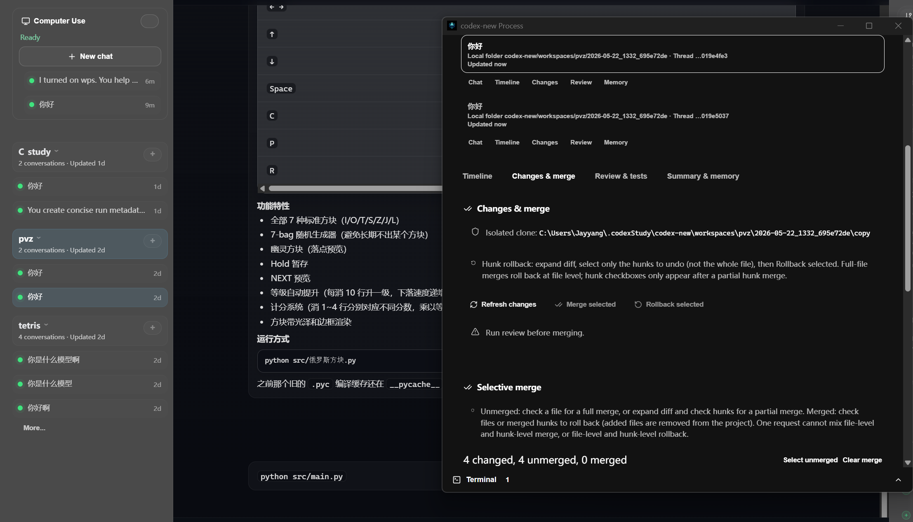
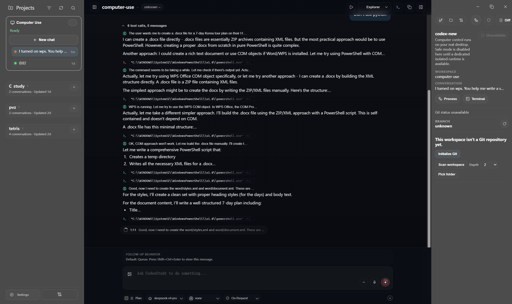

<p align="center">
  <strong>CodexStudy</strong><br />
  Local-first AI coding desktop for learning and development
</p>

<p align="center">
  English | <a href="./README.zh-CN.md">简体中文</a>
</p>

<p align="center">
  <a href="https://github.com/YangJin-Lei/codexStudy">GitHub</a> ·
  <a href="https://github.com/YangJin-Lei/codexStudy/releases">Releases</a> ·
  <a href="https://github.com/YangJin-Lei/codexStudy/actions/workflows/codexstudy-release.yml">CI Builds</a> ·
  <a href="./docs/CODEXSTUDY.md">Build Guide</a> ·
  <a href="./codex-new.md">codex-new Design</a>
</p>

> **Notice**  
> This repo supports the author's **graduation project**. Features are still evolving and it is **not production-ready**. Please use [Issues](https://github.com/YangJin-Lei/codexStudy/issues) for feedback.

---

## What is CodexStudy

**CodexStudy** is a **local-first** AI coding environment with a **desktop app** (Tauri + React) and the **`codexstudy`** CLI. The agent works in an **isolated project copy** while you **stream the process**, **review before merge**, **roll back file changes**, and optionally use **Computer Use** for desktop automation.

- Default config home: **`~/.codexStudy`**, separate from upstream Codex CLI `~/.codex`
- **Mainland China users**: no ChatGPT login required—set **DeepSeek** or other OpenAI-compatible APIs under **Settings → Codex**; build guide: [docs/CODEXSTUDY.md](./docs/CODEXSTUDY.md)

---

## Attribution

This is a **derivative work** built on:

| Source | Notes |
|--------|--------|
| **[openai/codex](https://github.com/openai/codex)** | Core agent, CLI, `codex-rs` runtime (Apache-2.0) |
| **CodexMonitor** | Early desktop shell ideas; `desktop/` rebranded as CodexStudy |
| **[computer-use](./computer-use/)** | Bundled Open Computer Use plugin and MCP resources |

Upstream Codex install docs are in **[Upstream reference](#upstream-openai-codex-reference)** at the end—they are **not** required to use CodexStudy.

---

## Features (codex-new safe workflow)

The desktop **codex-new** stack (`desktop/` + `codex-rs/codex-new-core/`) keeps the AI from writing your original project directly. Full design: [codex-new.md](./codex-new.md).

<p align="center">
  
</p>

| # | Capability |
|---|------------|
| 1 | **Streaming process** — timeline of reads, commands, and edits, not only the final diff |
| 2 | **Isolated workspace** — auto clone/worktree; the agent only writes to the copy |
| 3 | **Review & merge** — human or AI review; merge only confirmed hunks after tests |
| 4 | **Rollback (traceback)** — per-file snapshots to restore after mistaken merges |
| 5 | **Summaries & memory** — per-turn summaries and candidate memory you can apply or skip |
| 6 | **Isolated testing** (optional) — run tests on project/copy; Docker env is planned |

Implementation: `desktop/src/features/codex-new/`, `codex-rs/codex-new-core/` (`traceback.rs`, `memory.rs`, `engine.rs`).

---

## Computer Use

CodexStudy bundles **Open Computer Use** (`computer-use/`) to operate desktop apps (browser, Office, etc.) via MCP inside a controlled workspace, alongside codex-new file isolation.

<p align="center">
  
</p>

Code: `desktop/src/features/computer-use/`, `desktop/src-tauri/src/computer_use/`

---

## Quick start

### Install

1. Download from [Releases](https://github.com/YangJin-Lei/codexStudy/releases) or [Actions artifacts](https://github.com/YangJin-Lei/codexStudy/actions/workflows/codexstudy-release.yml)
2. Run the **CodexStudy desktop app** (not the CLI sidecar alone)
3. **Settings → Codex** — choose a provider and enter your **DeepSeek** (or compatible) API key
4. Add a local project, enable **Security mode** in the coding panel, open **Process / Terminal** for the live workflow window

### Build from source

```shell
# Windows NSIS installer
corepack pnpm --dir desktop tauri:build:nsis:win

# CLI only
corepack pnpm --dir desktop package:cli:win
```

Unsigned builds may show security prompts on Windows/macOS—choose **Run anyway** / **Open anyway**.

---

## Repository layout

```text
codex/
├── desktop/                 # CodexStudy desktop (Tauri + React)
├── codex-rs/codex-new-core/ # Isolated tasks, merge, rollback, summaries
├── computer-use/            # Computer Use bundle
├── codex-new.md             # Product design
├── docs/CODEXSTUDY.md       # Build & CI
└── docs/images/             # README screenshots
```

---

## Community

- Questions and discussion: [GitHub Issues](https://github.com/YangJin-Lei/codexStudy/issues)
- Community chat QR code may be added here when the project gains more traction (Star to follow updates)

<!-- When ready, uncomment:
<p align="center">
  
</p>
-->

---

## License & disclaimer

- Contains code from [openai/codex](https://github.com/openai/codex), under upstream **Apache-2.0** terms
- **CodexStudy** is independently maintained and **not affiliated** with OpenAI's official Codex product

---

## Upstream OpenAI Codex reference

<details>
<summary>Official Codex CLI docs (not CodexStudy)</summary>

```shell
npm install -g @openai/codex
# or: brew install --cask codex
```

See [openai/codex](https://github.com/openai/codex) for upstream documentation.

</details>
