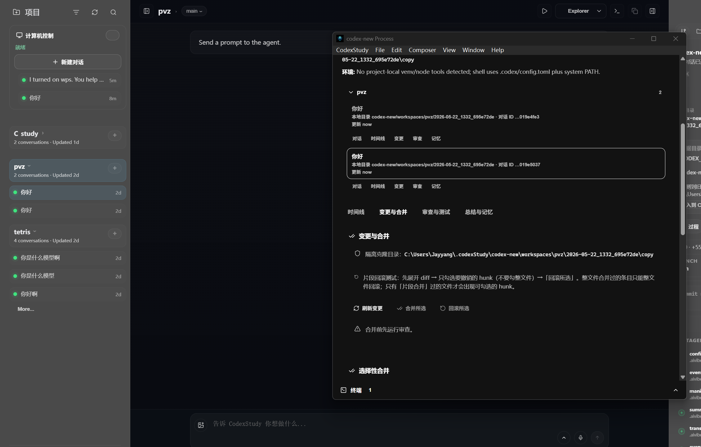
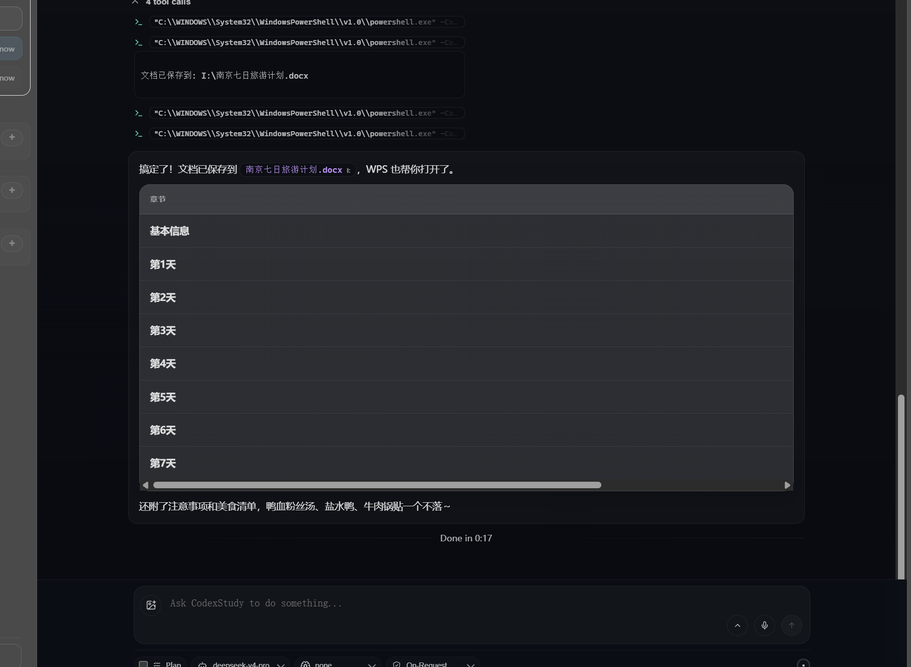

<p align="center">
  <strong style="font-size: 1.35em;">CodexStudy</strong><br />
  <sub>本地优先 · 学做项目 · 中国大陆可用</sub>
</p>

<p align="center">
  <strong>面向日常开发、学习与本地办公的 AI 编程桌面</strong><br />
  代码、任务、快照默认留在本机；AI 在隔离副本里改，你审完再合并。
</p>

<p align="center">
  <code>本地数据</code> · <code>安全隔离</code> · <code>DeepSeek</code> · <code>开源可安装</code>
</p>

<p align="center">
  <a href="./README.md">English</a> | 简体中文
</p>

<p align="center">
  <a href="https://github.com/YangJin-Lei/codexStudy">GitHub</a> ·
  <a href="https://github.com/YangJin-Lei/codexStudy/releases">Releases</a> ·
  <a href="https://github.com/YangJin-Lei/codexStudy/actions/workflows/codexstudy-release.yml">自动打包</a> ·
  <a href="./docs/CODEXSTUDY.md">构建说明</a> ·
  <a href="./codex-new.md">codex-new 设计</a>
</p>

> **🇨🇳 中国大陆用户**  
> 无需 ChatGPT / 境外账号。打开 **设置 → Codex**，选择 **DeepSeek**（或其它 OpenAI 兼容 API），填入 Key 即可开聊。  
> 配置与官方 Codex CLI 分离，默认目录 **`~/.codexStudy`**。详见 [docs/CODEXSTUDY.md](./docs/CODEXSTUDY.md)。

> **项目说明**  
> 本项目源于作者**毕业设计**的开源实践，但**已可用于日常本地开发与办公**：写业务代码、改 Bug、做小工具、毕设/自学均可。  
> 核心流程（桌面端、对话、安全隔离、审核合并、回滚、DeepSeek 等）已较完整；**新能力与体验细节仍在持续优化**，偶有小瑕疵欢迎 [Issues](https://github.com/YangJin-Lei/codexStudy/issues) 反馈。

---

## CodexStudy 是什么

**CodexStudy** = **图形桌面端**（Tauri + React）+ 终端 **`codexstudy`**，本地优先的 AI 编程环境，适合**日常写代码、课程/毕设、个人与小团队项目**：

| 你关心的 | 我们怎么做的 |
|----------|----------------|
| **本地 / 办公** | 项目、隔离副本、回溯快照、任务记录默认在磁盘；除模型 API 外不主动上传源码，适合日常在本机干活 |
| **学得明白** | 过程可见（读文件 / 跑命令 / 改代码时间线），改坏了能回滚，也适合边做边学 |
| **中国大陆** | 内置 **DeepSeek** 等国内常用兼容接口，不绑 ChatGPT 登录 |

可选 **Computer Use**：在本机受控环境里操作浏览器、Office 等（与文件隔离策略配合）。

### 现在就能做什么

- **正常开发**：多工作区、线程对话、Composer、终端、Git diff、模型与 API 配置（含 DeepSeek）
- **安全模式（codex-new）**：隔离副本 → 流式过程 → 审核合并 → 回滚 / 编辑回溯
- **Computer Use**：桌面应用自动化（需本机权限与 bundled 运行时）
- **安装使用**：Windows / Linux / macOS 安装包见 [Releases](https://github.com/YangJin-Lei/codexStudy/releases) 或 [Actions 构建产物](https://github.com/YangJin-Lei/codexStudy/actions/workflows/codexstudy-release.yml)（`codexstudy-nsis-Windows`、`codexstudy-appimage-Linux`、`codexstudy-dmg-macOS`）

### 还在打磨什么

- 界面与文案的**中英文一致性**（部分提示仍在优化）
- 安全模式下的**环境绑定**、大项目首次拷贝耗时
- **自动挂 Release**、Docker 隔离测试等；CI 已支持 Win/Linux/macOS Artifacts，Release 页需手动上传或打 tag 后自行整理
- 与上游 Codex 同步时的**合并冲突**需自行关注

> 不是「实验室 demo」——你可以像日常 IDE 助手一样用；只是作为独立产品仍在快速迭代，**重要项目请自行备份 + 习惯用安全模式与回滚**。

---

## 来源说明

本仓库为**二次开发**作品，在以下项目基础上演进：

| 来源 | 说明 |
|------|------|
| **[openai/codex](https://github.com/openai/codex)** | 核心 Agent、CLI、`codex-rs` 运行时（Apache-2.0） |
| **CodexMonitor** | 早期桌面壳思路；`desktop/` 已 rebranding 为 CodexStudy |
| **[computer-use](./computer-use/)** | 捆绑的 Open Computer Use 插件与 MCP 资源 |

上游 Codex 的安装说明见文末 **[上游参考](#upstream-openai-codex-reference)**，**不是** CodexStudy 的使用前提。

---

## 核心能力（codex-new 安全开发流程）

如果你用过「让 AI 直接改项目」的工具，下面这些台词可能很熟悉——**不一定是你说的，但一定是有人骂过的**：

> **「你他妈为什么要删我的文件？！」**  
> **「我源代码呢？打开文件夹就剩个 README 了？？」**  
> **「我就让你改一行，你怎么把半个项目重构没了？」**  
> **「合并完才发现全错了——Git 呢？Git 说我 working tree 已经干净了？？？」**  
> **「终端弹窗全是 Approval needed，我中文系统你英文问我批不批？」**

于是我们做了 **codex-new 安全模式**：不是让 AI 变乖，是让**你的真·源代码先活下来**，改坏了还能捞回来。

<p align="center">
  
</p>

| 你骂的那句 | 我们推出的 |
|------------|------------|
| 「谁让你动我原项目的？」 | **隔离工作区** — AI 只在副本里写；原目录默认只读 |
| 「删了就没了？」 | **审核后再合并** — 没你点头，改动进不了主项目 |
| 「合并完才发现全错了」 | **回滚（Rollback）** — 合并前快照；按文件或按 hunk 撤销 |
| 「改乱了连 diff 都看不懂」 | **流式过程** — 读文件、跑命令、改代码全程时间线，不是黑箱 |
| 「隔离区里删的文件算谁的？」 | **编辑回溯（Traceback）** — 原项目 vs 隔离副本对照，合并前也能恢复副本侧 |
| 「测试挂了还让我合并？」 | **隔离测试**（可选）— 先跑命令看结果，再决定合不合并 |
| 「它到底记住了什么鬼？」 | **任务总结与记忆** — 每轮总结 + 候选记忆，**你点头才写入** |

桌面端 **codex-new**（`desktop/` + `codex-rs/codex-new-core/`）把上面这套串成流水线。完整设计见 [codex-new.md](./codex-new.md)；实现见 `traceback.rs`、`memory.rs`、`engine.rs`。

**一句话：** AI 可以在副本里随便折腾；**你的主项目，只有你点「合并」才会动。**

---

## Computer Use（计算机控制）

CodexStudy 捆绑 **Open Computer Use**（`computer-use/`），通过 MCP 在受控工作区内操作桌面应用（浏览器、Office 等），与 codex-new 的文件隔离策略相配合。

<p align="center">
  
</p>

相关代码：`desktop/src/features/computer-use/`，`desktop/src-tauri/src/computer_use/`

---

## 快速开始

### 安装

1. 从 [Releases](https://github.com/YangJin-Lei/codexStudy/releases) 或 [Actions 构建产物](https://github.com/YangJin-Lei/codexStudy/actions/workflows/codexstudy-release.yml) 下载安装包
2. 运行 **CodexStudy 图形程序**（不要与仅终端的 CLI sidecar 混淆）
3. 在 **设置 → Codex** 选择模型提供方，填入 **DeepSeek**（或其他兼容服务）的 API Key
4. 添加本地项目，在编码区开启 **安全模式（Security）**，用 **Process / Terminal** 打开过程窗口

### 自行编译

```shell
# Windows NSIS 安装包
corepack pnpm --dir desktop tauri:build:nsis:win

# 仅终端 CLI
corepack pnpm --dir desktop package:cli:win
```

未签名安装包在 Windows / macOS 上可能出现安全提示，选择「仍要运行」即可。

---

## 仓库结构

```text
codex/
├── desktop/                 # CodexStudy 桌面端
├── codex-rs/codex-new-core/ # 隔离任务、合并、回溯、总结
├── computer-use/            # Computer Use 捆绑资源
├── codex-new.md             # 产品设计
├── docs/CODEXSTUDY.md       # 构建与 CI
└── docs/images/             # README 配图
```

---

## 交流

- 问题、建议、学习交流：[GitHub Issues](https://github.com/YangJin-Lei/codexStudy/issues)
- 学习交流群二维码：项目关注度提升后会在本节补充（可先 Star 关注更新）

<!-- 群二维码就绪后取消注释：
<p align="center">
  
</p>
-->

---

## 许可与声明

- 含基于 [openai/codex](https://github.com/openai/codex) 的代码，遵循上游 **Apache-2.0** 要求
- 产品名 **CodexStudy** 由维护者独立发布，与 OpenAI 官方 Codex 产品**无隶属关系**
- **免责声明**：软件按「现状」提供；用于工作项目时建议开启安全模式、定期备份，并对 API 密钥与本地数据自行负责

---

## 上游 OpenAI Codex 参考

<details>
<summary>官方 Codex CLI 文档（非 CodexStudy 产品说明）</summary>

```shell
npm install -g @openai/codex
# 或：brew install --cask codex
```

完整上游文档见 [openai/codex](https://github.com/openai/codex)。

</details>
