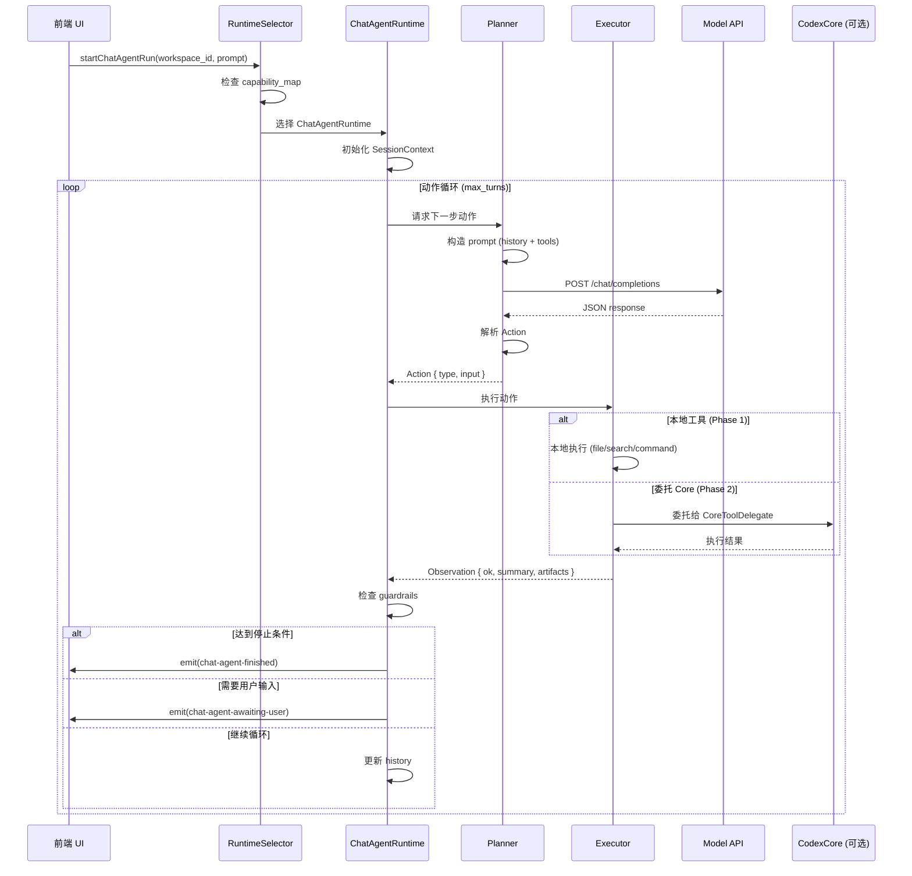

# 聊天模型 Agent 架构设计

> **文档版本**: v1.1  
> **最后更新**: 2026-05-26  
> **状态**: 设计阶段 → 待实施

## 目录

- [1. 目标与背景](#1-目标与背景)
- [2. 设计原则](#2-设计原则)
- [3. 借鉴来源](#3-借鉴来源)
- [4. 架构设计](#4-架构设计)
- [5. 后端模块详解](#5-后端模块详解)
- [6. 前端架构](#6-前端架构)
- [7. 协议定义](#7-协议定义)
- [8. 执行流程](#8-执行流程)
- [9. 错误处理与恢复](#9-错误处理与恢复)
- [10. 实施路线图](#10-实施路线图)
- [11. 测试策略](#11-测试策略)
- [12. 风险与对策](#12-风险与对策)
- [附录 A: API 参考](#附录-a-api-参考)
- [附录 B: 配置示例](#附录-b-配置示例)

---

## 1. 目标与背景

### 1.1 问题陈述

为当前 `CodexStudy` 项目新增一条专门面向 `chat` 类模型的 Agent 执行链路，用来补足：

- 现有链路偏向 `responses` 风格模型（如 Anthropic Claude）
- 国内很多模型只能稳定走 `chat completions` API（如 Qwen、DeepSeek、GLM）
- chat 模型在原生工具调用、结构化中间态、长链路动作控制上不够稳定

### 1.2 设计目标

这次设计的目标**不是替换**现有 `codex-new`，而是为 **chat 类模型** 提供 **双引擎架构**，可按设置 / 任务 / 模型能力选择：

| 引擎 | 路径 | 适用场景 | 性能目标 |
|------|------|----------|----------|
| **CodexCoreRuntime** | 现有 `app-server` + `codex-rs/core`<br/>（国内模型可走 `provider_compat_bridge`） | • MCP 工具集成<br/>• Skills 复用<br/>• 多 agent 协作<br/>• 完整 sandbox 隔离 | 单轮响应 < 3s<br/>工具调用延迟 < 500ms |
| **ChatAgentRuntime** | 新建 `chat_agent/`<br/>（结构化 JSON 动作循环） | • 弱工具调用模型<br/>• 步骤透明展示<br/>• 强 guardrails 控制<br/>• 国内模型优化 | 单轮响应 < 5s<br/>动作解析 < 200ms |
| **Hybrid**（Phase 2） | Chat Agent 编排 +<br/>`CoreToolDelegate` 执行 | • 自研协议优势<br/>• 复用 core 沙箱<br/>• 统一工具实现 | 综合两者优势 |

### 1.3 共享层与分流层

**上层始终共用**（与引擎无关）：

- 线程管理（Thread）
- 工作区（Workspace）
- 变更集（Changeset）
- diff / merge / rollback
- review / summary / memory / test

**下层分流**（引擎特定）：

- 如何问模型（prompt 构造）
- 如何解析动作（JSON vs. function call）
- 如何控制循环（guardrails）

**关键理念**：不是二选一，而是 **同一 chat 模型既能走自研 agent，也能走 Codex 内核**。

---

## 2. 设计原则

### 2.1 不改现有主干职责

`codex-new-core` 继续负责：

- 隔离工作区
- 变更集和 diff
- rollback
- review
- summary
- memory
- test 执行相关状态

`ChatAgentRuntime` 不重复实现这些能力，只负责编排：

- 让 chat 模型决定下一步动作
- 执行动作
- 生成 observation
- 控制循环

### 2.2 避免大文件

不要做一个 `chat_agent_runtime.rs` 包办所有逻辑。  
后期维护最容易烂掉的地方，就是“一个 runtime 文件里同时有 prompt、状态机、解析、执行、事件、错误恢复”。

建议一开始就拆成小模块，按职责分层。

### 2.3 显式协议，避免自然语言硬解析

chat 模型必须输出结构化动作，而不是自由文本。

执行层只认：

- 动作 schema
- observation schema
- loop 状态

这样后续换模型、换 provider、补动作都不会散。

### 2.4 运行时分流，而不是 provider 分叉业务

不要在每个 provider 分支里单独塞“如果是 chat 模型就这样干”的分叉逻辑。

正确做法是：

- **provider 层**只负责发请求（鉴权、base URL、超时）
- **`runtime_selector`** 决定走 `CodexCoreRuntime` 还是 `ChatAgentRuntime`（或 Hybrid）

这样后面接 Qwen、DeepSeek、OpenAI 兼容接口、Anthropic 兼容网关，都不会把逻辑搅乱。

### 2.6 性能与可观测性

- **性能目标**：
  - Chat Agent 单轮响应 < 5s（P95）
  - 动作解析延迟 < 200ms
  - 工具执行超时默认 30s（可配置）
- **可观测性**：
  - 每个动作记录 trace_id
  - 关键路径打点（prompt 构造、模型调用、动作执行）
  - 前端实时展示步骤进度

---

## 3. 借鉴来源（`external/` 已落地）

本地参考仓库（阅读用，不迁入业务代码）：

- [OpenHands](../external/OpenHands)
- [Goose](../external/Goose)

### 3.1 从 OpenHands 借什么 → 落到哪

| OpenHands 做法 | 代码位置 | 落到 CodexStudy |
|----------------|----------|-----------------|
| 事件独立存储 / 检索 / 流式 | `openhands/app_server/event/event_service.py`、`filesystem_event_service.py` | `chat_agent/state/event_mapper.rs`；Codex 内核仍用 app-server 事件 |
| 会话生命周期与状态 | `app_conversation/live_status_app_conversation_service.py` | `session/session_builder.rs`：启动前装配 workspace、model、工具集 |
| Agent 类型分流 | `app_conversation_models.py` 的 `AgentType`（`default` / `plan`） | `runtime_selector.rs` + `capability_map.rs`（引擎与能力映射，而非按厂商分叉） |

### 3.2 从 Goose 借什么 → 落到哪

| Goose 做法 | 代码位置 | 落到 CodexStudy |
|------------|----------|-----------------|
| Session 启动前并行加载 extensions | `goose-cli/src/session/builder.rs`（`load_extensions`、`SessionBuilderConfig`） | `session/session_builder.rs`；扩展列表在 **CodexCoreRuntime** 侧由 core 负责 |
| Provider 与 Agent 分离 | `goose/src/providers/api_client.rs`（`ApiClient` 只管 HTTP/鉴权） | `planner/planner_client.rs` 只管 chat 请求；编排不进 provider |
| 读文件 / 行号切片 | `developer/edit.rs` → `FileReadParams` | `executor/file_tools.rs` 或委托 core |
| 编辑：唯一匹配 / 无匹配预览 / 多匹配上下文 | `edit.rs` → `string_replace()`（0/1/N 匹配分支） | `executor/file_tools.rs` + observation 的 `artifacts` |
| Shell 超时与输出截断 | `developer/shell.rs`（`OUTPUT_LIMIT_BYTES` 等） | `executor/command_tools.rs` 或 **Hybrid** 时 `core_delegate.rs` |
| 重复工具调用上限 | `SessionBuilderConfig.max_tool_repetitions` | `loop_control/guardrails.rs` |

### 3.3 与现有 CodexStudy 代码的关系

- **CodexCoreRuntime** ≈ 现有 `spawn_workspace_session` + `codex-rs/core` +（可选）[provider_compat_bridge.rs](../desktop/src-tauri/src/shared/provider_compat_bridge.rs)。
- **ChatAgentRuntime** = 本文档新建的 `chat_agent/`；与 core **并行**，共用 `codex-new-core`。
- Goose 的 `acp/fs.rs` 说明：文件工具可复用同一套 `edit` / `shell` 实现；我们优先 **委托 core**，其次抄 Goose 的 `string_replace` 语义。

## 4. 在当前项目中的合理位置

结合你现在的仓库结构，建议不要把 chat agent 散落到很多老模块里，而是集中落在一个新边界下。

当前后端主目录：

- [desktop/src-tauri/src](</H:/codex/desktop/src-tauri/src>)

当前前端主目录：

- [desktop/src/features/codex-new](</H:/codex/desktop/src/features/codex-new>)
- [desktop/src/services](</H:/codex/desktop/src/services>)

## 5. 后端推荐架构

推荐在 `desktop/src-tauri/src` 下新增一个独立目录：

- `chat_agent/`

目录结构建议如下：

```text
desktop/src-tauri/src/chat_agent/
  mod.rs
  runtime.rs
  runtime_selector.rs
  session/
    mod.rs
    session_context.rs
    session_builder.rs
    capability_map.rs
  protocol/
    mod.rs
    action.rs
    observation.rs
    prompt_contract.rs
    final_result.rs
  planner/
    mod.rs
    prompt_builder.rs
    response_parser.rs
    planner_client.rs
  executor/
    mod.rs
    dispatcher.rs
    file_tools.rs
    search_tools.rs
    command_tools.rs
    approval_tools.rs
    core_delegate.rs      # Phase 2：委托 codex-rs/core ToolRouter
  loop_control/
    mod.rs
    run_loop.rs
    guardrails.rs
    retry_policy.rs
    stop_conditions.rs
  state/
    mod.rs
    run_state.rs
    step_record.rs
    event_mapper.rs
  errors/
    mod.rs
    runtime_error.rs
    parse_error.rs
    tool_error.rs
```

这个拆法的核心优点是：

- `protocol/` 只放协议，稳定
- `planner/` 只管怎么问模型
- `executor/` 只管本地动作
- `loop_control/` 只管循环和保护逻辑
- `state/` 只管运行态和前端映射

这样不会出现一个 1500 行的“超级 runtime 文件”。

## 6. 每个后端模块的职责

### 6.1 `runtime.rs`

只做总入口：

- 接收启动请求
- 创建 session context
- 调用 run loop
- 返回最终结果

不要放：

- prompt 拼接细节
- JSON 解析细节
- 文件执行逻辑

### 6.2 `runtime_selector.rs`

只负责 **引擎选择**（尽量薄，规则表驱动）：

| 输入 | 推荐引擎 |
|------|----------|
| 用户设置 `engine = codex_core` | `CodexCoreRuntime` |
| 用户设置 `engine = chat_agent` | `ChatAgentRuntime` |
| 任务需要 MCP / 指定 skill / 多 agent | `CodexCoreRuntime`（或提示用户切换） |
| 模型 `tool_call_unreliable` 且未强制 core | 默认 `ChatAgentRuntime` |
| 模型原生 Responses 工具调用稳定 | `CodexCoreRuntime`（可不走 bridge） |
| 仅 chat API + 要全功能 | `CodexCoreRuntime` + compat bridge |
| 仅 chat API + 要步骤卡片 / 强协议 | `ChatAgentRuntime` |

`capability_map.rs` 维护模型能力与默认引擎；**不在 provider 配置里写业务分支**。

### 6.3 `session/`

负责把当前项目已有上下文装配成一次 agent 运行所需的环境：

- workspace id
- thread id
- task id
- model/provider
- 安全模式
- 工作目录
- 当前变更概览
- 允许使用的工具集合

这里要借 OpenHands 的思路：  
**先把执行环境组装好，再启动 agent。**

### 6.4 `protocol/action.rs`

只定义 chat agent 可以发出的动作。

建议第一版动作枚举：

- `ReadFile`
- `SearchCode`
- `EditFile`
- `RunCommand`
- `AskUser`
- `Finalize`

第二版再加：

- `RefreshChanges`
- `RunReview`
- `WriteSummary`
- `ApplyMemory`
- `RollbackTask`

### 6.5 `protocol/observation.rs`

定义动作执行后的统一 observation。

不要让每种工具自由返回字符串。  
要统一成结构化格式，至少带：

- `action_type`
- `ok`
- `summary`
- `details`
- `artifacts`

这样前端、日志、模型回喂都能复用。

### 6.6 `planner/`

负责和 chat 模型交互。

拆分原因：

- prompt 构造会越来越复杂
- 不同 provider 可能有不同消息格式
- response 解析和 prompt 生成最好不要耦合

建议再细分：

- `prompt_builder.rs`：系统提示词、工具说明、输出约束
- `planner_client.rs`：真正调用模型
- `response_parser.rs`：把模型文本解析成 `Action`

### 6.7 `executor/`

这是最容易膨胀的地方，所以一定要按工具类型拆。

建议：

- `file_tools.rs`：读文件、写文件、替换编辑
- `search_tools.rs`：`rg` 搜索、文件列表
- `command_tools.rs`：运行命令、截断输出、超时
- `approval_tools.rs`：用户确认或暂停
- `dispatcher.rs`：根据 `Action` 分派到具体工具

这里主要借 Goose 的 `edit.rs` 和 `shell.rs` 思路（`string_replace` 的 0/1/N 匹配与预览）。

**`core_delegate.rs`（Phase 2，Hybrid）**：

- 将 `RunCommand`、`EditFile` 等动作转为 core 可执行的 `ToolCall` / app-server 调用
- 把 core 返回结果转成本文档的 `observation` schema
- 避免长期维护两套 sandbox；自研 agent 只保留 core 没有的：`AskUser`、`Finalize`、codex-new 专用动作

### 6.8 `loop_control/`

只管循环，不管具体业务。

建议职责：

- 控制最大轮数
- 控制最大重复动作数
- 控制解析失败重试次数
- 控制 shell 超时恢复
- 判断该继续、暂停、结束

这层就是让 runtime 稳定的关键。

### 6.9 `state/`

负责把 chat runtime 的内部状态映射到当前项目前后端都能理解的记录结构。

建议职责：

- 当前 run 状态
- 当前 step 列表
- action 记录
- observation 记录
- 映射成你现在 `codex-new` 状态区能消费的结构

## 7. 前端推荐架构

前端不要把 chat agent 直接塞进一个现有大组件里。

建议仍然挂在 `codex-new` 下，但单独分目录：

```text
desktop/src/features/codex-new/chat-agent/
  components/
    ChatAgentRunPanel.tsx
    ChatAgentStepList.tsx
    ChatAgentStepCard.tsx
    ChatAgentActionBadge.tsx
    ChatAgentObservationView.tsx
  hooks/
    useChatAgentRun.ts
    useChatAgentEvents.ts
  state/
    chatAgentStore.ts
    chatAgentSelectors.ts
  types/
    chatAgent.ts
```

这样做有两个好处：

- 继续复用 `codex-new` 视图入口
- 但 chat agent 逻辑不会把原组件继续压大

> **补充（2026-05-27）**：
> Chat Agent 不应只在安全模式工作台可见。普通开发主路径（主页 Composer/线程发送）也要走同一套 `runtime_selector` 选型逻辑：
> - 命中 `chat_agent` 时，走 `startChatAgentRun` 并在线程侧展示步骤进度；
> - 命中 `codex_core` 时，继续走现有 `send_user_message`。
> - `Computer Use` 场景暂不接入 Chat Agent，保持原链路。

## 8. 前后端连接层怎么放

你现在连接层主要在：

- [desktop/src/services/tauri.ts](</H:/codex/desktop/src/services/tauri.ts>)
- [desktop/src/services/events.ts](</H:/codex/desktop/src/services/events.ts>)

建议只做薄接入，不在这里写业务。

建议新增：

### 8.1 Tauri invoke 接口

放在 `tauri.ts` 里新增少量方法：

- `getAgentEngine` / `setAgentEngine`（`codex_core` | `chat_agent`）
- `startChatAgentRun`
- `getChatAgentRunState`
- `cancelChatAgentRun`
- `resumeChatAgentRun`

`CodexCoreRuntime` 继续走现有 thread / turn API，不必重复封装。

### 8.2 前端事件订阅

在 `events.ts` 新增事件 hub：

- `chat-agent-run-updated`
- `chat-agent-step-added`
- `chat-agent-awaiting-user`
- `chat-agent-finished`

前端组件只订阅这些事件，不直接理解后端内部状态机。

## 9. 推荐的领域边界

这一块很重要，关系到后期好不好维护。

```text
  codex-new（桌面 + codex-new-core）
           │
           ├── CodexCoreRuntime ──► app-server ──► codex-rs/core
           │         （MCP / skills / ToolRouter / sandbox）
           │
           └── ChatAgentRuntime ──► chat_agent/
                     │                    │
                     │                    └── core_delegate ──► core（可选）
                     └── planner + protocol + loop_control
```

### 9.1 `codex-new-core` 的边界

继续只做：

- 工作区
- 变更
- review
- rollback
- summary
- memory

**两个引擎共用**，不感知具体走哪条推理链路。

### 9.2 `codex-rs/core` 的边界（CodexCoreRuntime）

继续负责（**不要**在 `chat_agent/executor` 里复制）：

- turn 循环、`ToolRouter`、工具注册与派发
- sandbox、approval、MCP、skills、compaction、multi_agents
- rollout / thread store

chat 模型接入 core 的方式：**compat bridge（已有）** 或 fork 内 **`StructuredChatBackend`**（将 JSON `action` 合成 `ResponseItem::FunctionCall`，仍走同一 turn 循环）。

### 9.3 `desktop/src-tauri/src/chat_agent` 的边界

只做：

- **ChatAgentRuntime**：chat 模型编排、动作解析、循环与 guardrails
- 本地 executor（V1）或 **core_delegate**（V2 Hybrid）
- 映射到 codex-new 时间线 / 步骤 UI 的 event

**不做**：MCP 注册、skills 加载、完整 sandbox 策略（交给 core）。

### 9.4 `desktop/src/services` 的边界

只做：

- invoke
- event bridge

### 9.5 `desktop/src/features/codex-new/chat-agent` 的边界

只做：

- 展示运行过程
- 用户确认交互
- 最终结果展示

不要把业务逻辑塞回组件里。

## 8. 执行流程

### 8.1 完整时序图



### 8.2 引擎选择决策树

```
用户发起任务
    │
    ├─ 用户强制指定引擎？
    │   ├─ Yes → 使用指定引擎
    │   └─ No ↓
    │
    ├─ 任务需要 MCP / Skills / 多 Agent？
    │   ├─ Yes → CodexCoreRuntime
    │   └─ No ↓
    │
    ├─ 模型在 capability_map 中标记为 tool_call_unreliable？
    │   ├─ Yes → ChatAgentRuntime (默认)
    │   └─ No ↓
    │
    ├─ 模型支持原生 Responses API？
    │   ├─ Yes → CodexCoreRuntime
    │   └─ No ↓
    │
    └─ 仅支持 Chat API
        ├─ 需要全功能 → CodexCoreRuntime + compat_bridge
        └─ 需要步骤卡片 / 强协议 → ChatAgentRuntime
```

### 8.3 单轮动作执行流程

```
1. Planner 构造 Prompt
   ├─ System: 角色定义 + 工具说明 + 输出约束
   ├─ History: 前 N 轮对话（压缩）
   └─ User: 当前任务 + 上下文

2. 调用模型 API
   ├─ 超时控制: 30s (可配置)
   ├─ 重试策略: 指数退避，最多 3 次
   └─ 流式输出: 支持 SSE (可选)

3. 解析响应
   ├─ 提取 JSON: {"thought": "...", "action": {...}}
   ├─ 验证 schema: action.type 必须在允许列表
   └─ 失败处理: 最多重试 2 次，否则进入 AskUser

4. 执行动作
   ├─ 路由到对应 tool: file_tools / search_tools / command_tools
   ├─ 安全检查: 路径白名单、命令黑名单
   └─ 超时控制: 默认 30s，shell 可配置

5. 生成 Observation
   ├─ 压缩输出: 最大 12,000 字符
   ├─ 提取关键信息: exit_code / file_path / error_message
   └─ 结构化返回: { ok, summary, details, artifacts }

6. Guardrails 检查
   ├─ 重复动作: 连续 3 次相同动作 → 强制 AskUser
   ├─ 失败次数: 连续 2 次失败 → 提示换策略
   └─ 最大轮数: 达到 max_turns → 自动 Finalize
```

---

## 9. 错误处理与恢复

### 9.1 错误分类

| 错误类型 | 示例 | 恢复策略 | 最大重试 |
|---------|------|---------|---------|
| **解析错误** | JSON 格式错误、缺少必填字段 | 重新请求模型，附带错误提示 | 2 次 |
| **工具执行错误** | 文件不存在、命令超时 | 返回详细 observation，让模型调整 | 0 次（不重试） |
| **模型 API 错误** | 429 限流、500 服务错误 | 指数退避重试 | 3 次 |
| **安全策略拒绝** | 路径越界、危险命令 | 返回拒绝原因，进入 AskUser | 0 次 |
| **循环检测** | 重复动作、无进展 | 强制 AskUser 或 Finalize | - |

### 9.2 错误恢复流程图

```
错误发生
    │
    ├─ 解析错误？
    │   ├─ 重试次数 < 2 → 重新请求模型（附带错误提示）
    │   └─ 重试次数 ≥ 2 → 进入 AskUser 状态
    │
    ├─ 模型 API 错误？
    │   ├─ 429 限流 → 等待 retry-after，最多 3 次
    │   ├─ 5xx 错误 → 指数退避 (1s, 2s, 4s)
    │   └─ 4xx 错误 → 记录日志，进入 Failed 状态
    │
    ├─ 工具执行错误？
    │   ├─ 生成详细 observation (exit_code, stderr)
    │   ├─ 让模型根据错误调整策略
    │   └─ 如果连续 2 次失败 → 提示 "考虑换个方法"
    │
    ├─ 安全策略拒绝？
    │   ├─ 返回拒绝原因 observation
    │   └─ 进入 AwaitingUser 状态，等待用户确认
    │
    └─ 循环检测？
        ├─ 重复动作 → 强制 AskUser ("你似乎在重复操作")
        └─ 达到 max_turns → 自动 Finalize (总结当前进展)
```

### 9.3 Guardrails 详细规则

```rust
// loop_control/guardrails.rs

pub struct GuardrailsConfig {
    /// 最大轮数（无用户输入）
    pub max_turns: u32,  // 默认 20
    
    /// 连续相同动作阈值
    pub max_identical_actions: u32,  // 默认 3
    
    /// 连续失败阈值
    pub max_consecutive_failures: u32,  // 默认 2
    
    /// 单个文件最大编辑次数
    pub max_edits_per_file: u32,  // 默认 5
    
    /// 解析失败重试次数
    pub max_parse_retries: u32,  // 默认 2
}

pub enum GuardrailViolation {
    MaxTurnsExceeded,
    RepeatedAction { action_type: String, count: u32 },
    ConsecutiveFailures { count: u32 },
    ExcessiveFileEdits { path: String, count: u32 },
}

pub enum GuardrailAction {
    Continue,
    ForceAskUser { reason: String },
    ForceFinalize { reason: String },
    AbortWithError { reason: String },
}
```

---

## 10. 实施路线图

建议把动作分成三层，而不是全部平铺。

### 10.1 基础动作

第一阶段必须有：

- 读文件
- 搜代码
- 编辑文件
- 跑命令
- 结束

### 10.2 工作区动作

第二阶段再接：

- 刷新变更
- 查看 diff
- 合并选中 hunk
- 回滚任务

### 10.3 产品动作

第三阶段再接：

- 运行 review
- 写 summary
- memory 候选提取与应用

这样能控制第一版复杂度。

### 10.1 阶段划分与时间估算

| 阶段 | 任务 | 交付物 | 预计工时 | 依赖 |
|------|------|--------|---------|------|
| **Phase 0** | 架构准备 | • 文档评审<br/>• 技术预研<br/>• 依赖梳理 | 3 天 | - |
| **Phase 1A** | 双引擎骨架 | • `runtime_selector.rs`<br/>• `capability_map.rs`<br/>• UI 引擎标签 | 5 天 | Phase 0 |
| **Phase 1B** | Chat Agent 最小链路 | • `protocol/` + `state/`<br/>• `executor/` (本地工具)<br/>• `planner/` + `loop_control/`<br/>• Tauri commands | 10 天 | Phase 1A |
| **Phase 1C** | 前端集成 | • `chat-agent/` 组件<br/>• 步骤卡片<br/>• 事件订阅 | 5 天 | Phase 1B |
| **Phase 2** | Core 整合 | • `core_delegate.rs`<br/>• `StructuredChatBackend` (可选) | 7 天 | Phase 1C |
| **Phase 3** | 优化与测试 | • 性能优化<br/>• 集成测试<br/>• 文档完善 | 5 天 | Phase 2 |

**总计**: 约 35 工作日（7 周）

### 10.2 详细实施步骤

#### **Phase 0: 架构准备 (3 天)**

**目标**: 确保团队对架构达成共识，技术栈可行

**任务清单**:
- [ ] 文档评审会议（2 小时）
- [ ] 搭建 `external/Goose` 和 `external/OpenHands` 本地环境
- [ ] 验证 `provider_compat_bridge` 可用性
- [ ] 确认 `codex-new-core` API 稳定性
- [ ] 创建 feature branch: `feat/chat-agent-runtime`

**交付物**:
- 评审会议纪要
- 技术预研报告（包含风险评估）

---

#### **Phase 1A: 双引擎骨架 (5 天)**

**目标**: 建立引擎选择机制，不影响现有功能

**任务清单**:
1. **创建 `runtime_selector.rs`** (1 天)
   ```rust
   pub enum AgentEngine {
       CodexCore,
       ChatAgent,
   }
   
   pub fn select_engine(
       user_preference: Option<AgentEngine>,
       model_name: &str,
       task_requirements: &TaskRequirements,
   ) -> AgentEngine {
       // 实现决策树逻辑
   }
   ```

2. **创建 `capability_map.rs`** (1 天)
   ```rust
   pub struct ModelCapability {
       pub tool_call_reliable: bool,
       pub supports_responses_api: bool,
       pub max_context_tokens: usize,
       pub recommended_engine: AgentEngine,
   }
   
   pub fn get_capability(model_name: &str) -> ModelCapability {
       // 从配置文件加载
   }
   ```

3. **UI 引擎标签** (2 天)
   - 在 `codex-new` 界面显示当前引擎
   - 添加引擎切换设置项
   - 事件: `engine-switched`

4. **集成测试** (1 天)
   - 测试引擎选择逻辑
   - 测试 UI 标签显示

**交付物**:
- `runtime_selector.rs` + 单元测试
- `capability_map.rs` + 配置文件
- UI 引擎标签组件

---

#### **Phase 1B: Chat Agent 最小链路 (10 天)**

**目标**: 实现 5 个基础动作的完整循环

**任务清单**:
1. **`protocol/` 模块** (2 天)
   - `action.rs`: 定义 5 个动作枚举
   - `observation.rs`: 统一 observation 结构
   - `prompt_contract.rs`: prompt 模板
   - 单元测试: schema 验证

2. **`executor/` 模块** (3 天)
   - `file_tools.rs`: read_file (借鉴 Goose)
   - `search_tools.rs`: search_code (ripgrep)
   - `command_tools.rs`: run_command (超时控制)
   - `dispatcher.rs`: 动作路由
   - 集成测试: 每个工具

3. **`planner/` 模块** (2 天)
   - `prompt_builder.rs`: 构造 chat messages
   - `planner_client.rs`: 调用模型 API
   - `response_parser.rs`: 解析 JSON
   - Mock 测试: 模拟模型响应

4. **`loop_control/` 模块** (2 天)
   - `run_loop.rs`: 主循环逻辑
   - `guardrails.rs`: 保护规则
   - `stop_conditions.rs`: 停止条件
   - 单元测试: guardrails 触发

5. **`state/` + Tauri commands** (1 天)
   - `run_state.rs`: 运行时状态
   - `event_mapper.rs`: 映射到 TimelineEvent
   - Tauri commands: start/cancel/resume

**交付物**:
- 完整的 `chat_agent/` 模块
- 单元测试覆盖率 > 80%
- 集成测试: 端到端动作循环

---

#### **Phase 1C: 前端集成 (5 天)**

**目标**: 用户可以看到 Chat Agent 的执行过程

**任务清单**:
1. **组件开发** (3 天)
   - `ChatAgentRunPanel.tsx`: 主面板
   - `ChatAgentStepList.tsx`: 步骤列表
   - `ChatAgentStepCard.tsx`: 单步卡片
   - `ChatAgentActionBadge.tsx`: 动作徽章
   - `ChatAgentObservationView.tsx`: 结果展示

2. **状态管理** (1 天)
   - `chatAgentStore.ts`: Zustand store
   - `useChatAgentRun.ts`: 运行状态 hook
   - `useChatAgentEvents.ts`: 事件订阅 hook

3. **集成测试** (1 天)
   - E2E 测试: 完整任务流程
   - UI 测试: 步骤卡片渲染

**交付物**:
- 前端组件库
- Storybook 文档
- E2E 测试用例

---

#### **Phase 2: Core 整合 (7 天)**

**目标**: 统一工具实现，避免两套 sandbox

**任务清单**:
1. **`core_delegate.rs`** (4 天)
   - 将 `RunCommand` 转为 core 的 `ToolCall`
   - 将 `EditFile` 委托给 core 的 patch 工具
   - 处理 core 返回结果
   - 集成测试: 与 core 交互

2. **`StructuredChatBackend` (可选)** (3 天)
   - Fork `codex-rs/core`
   - 实现 JSON action → ResponseItem 转换
   - 保持与现有 turn 循环兼容
   - 单元测试 + 集成测试

**交付物**:
- `core_delegate.rs` + 测试
- (可选) `StructuredChatBackend` PR

---

#### **Phase 3: 优化与测试 (5 天)**

**目标**: 性能达标，文档完善

**任务清单**:
1. **性能优化** (2 天)
   - Prompt 压缩策略
   - Observation 截断优化
   - 并发工具调用 (如果适用)
   - 性能基准测试

2. **集成测试** (2 天)
   - 多模型兼容性测试 (Qwen, DeepSeek, OpenAI)
   - 引擎切换测试
   - 错误恢复测试
   - 长任务稳定性测试

3. **文档完善** (1 天)
   - API 文档
   - 用户手册
   - 故障排查指南
   - 架构图更新

**交付物**:
- 性能测试报告
- 完整测试套件
- 用户文档

---

## 11. 测试策略

建议后端只维护有限状态，不要放任模型想怎么走就怎么走。

```text
Pending
-> Preparing
-> Planning
-> Executing
-> Observing
-> AwaitingUser
-> Finalizing
-> Completed
-> Failed
-> Cancelled
```

说明：

- `Preparing`：组装上下文
- `Planning`：请求模型动作
- `Executing`：执行本地动作
- `Observing`：压缩执行结果
- `AwaitingUser`：需要用户回答
- `Finalizing`：输出最终总结

## 12. 推荐的最小动作协议

模型每轮只允许输出一个动作。

建议统一结构：

```json
{
  "thought": "需要先查看 package.json 再决定测试命令。",
  "action": {
    "type": "read_file",
    "input": {
      "path": "desktop/package.json",
      "line": 1,
      "limit": 200
    }
  }
}
```

建议原则：

- `thought` 只用于调试和记录
- `action` 才能驱动执行
- 没有 `action` 就算解析失败
- 非法动作直接进入 retry

## 13. 推荐的 observation 协议

统一结构：

```json
{
  "action_type": "run_command",
  "ok": false,
  "summary": "typecheck 失败，检测到 5 个错误。",
  "details": {
    "exit_code": 2
  },
  "artifacts": [
    {
      "kind": "diagnostic",
      "file": "desktop/src/services/tauri.ts",
      "line": 193,
      "message": "Property 'threadRegistry' is missing"
    }
  ]
}
```

统一 observation 的好处：

- 模型回喂稳定
- 前端展示简单
- 日志记录统一
- 后续换 provider 不用改执行层

## 14. 推荐的保护逻辑

### 14.1 解析重试

- 非法 JSON：最多重试 2 次
- 缺字段：最多重试 2 次
- 非法动作类型：最多重试 1 次

### 14.2 重复动作保护

例如：

- 连续 3 次相同 `read_file`
- 连续 2 次同一命令失败
- 连续 3 次编辑同一片段失败

达到阈值后：

- 强制返回 observation 提示
- 要求模型换动作
- 或进入 `AskUser`

### 14.3 命令执行保护

- 默认 timeout
- 最大输出字节限制
- 最大输出行数限制
- 仅允许在 workspace 白名单目录执行

### 14.4 编辑保护

- 文本替换必须唯一命中
- 无匹配时返回上下文预览
- 多匹配时返回候选片段

这个点可直接借 Goose 的 `edit.rs` 处理风格。

## 15. 推荐的 provider 分层

不要把每个 provider 写成一套 agent。

建议只保留两层：

### 15.1 Provider Client 层

职责：

- 发 chat 请求
- 处理鉴权
- 处理 base URL
- 处理超时
- 返回原始文本响应

### 15.2 Planner 层

职责：

- 把当前上下文转成 prompt
- 调用 provider client
- 解析成 `Action`

也就是：

```text
Planner
  -> ProviderClient
  -> parse Action
```

而不是：

```text
QwenAgent
DeepSeekAgent
OpenAICompatibleAgent
...
```

后者后期会很难维护。

## 15.1 引擎与 provider 的关系（三分流）

```text
                    runtime_selector
                           │
         ┌─────────────────┼─────────────────┐
         ▼                 ▼                 ▼
  CodexCoreRuntime   ChatAgentRuntime      Hybrid
  (app-server+core)  (chat_agent/)    (agent+core_delegate)
         │                 │
         ├─ Responses 原生 ─┤
         ├─ compat bridge ──┤  （chat API → 仍用 core）
         └─ StructuredChatBackend（fork，可选）
```

- **Planner 的 `ProviderClient`**：仅服务 `ChatAgentRuntime`。
- **CodexCoreRuntime**：继续用现有 model provider + bridge，**不**经 Chat Agent 的 JSON 协议。

## 16. 推荐的迁移方式

你后面是要迁移到你自己的 `codex` 目录里，所以建议按“整目录迁移”，不要按零散文件复制。

### 16.1 这次真正需要参考的目录

你只需要保留这些参考仓库目录做阅读：

#### OpenHands

- `external/OpenHands/openhands/app_server/event/`
- `external/OpenHands/openhands/app_server/app_conversation/`

#### Goose

- `external/Goose/crates/goose/src/acp/`
- `external/Goose/crates/goose/src/agents/platform_extensions/developer/`
- `external/Goose/crates/goose/src/providers/`
- `external/Goose/crates/goose-cli/src/session/`

其他目录对你这次需求不是重点，可以不迁。

### 16.2 迁到你自己的 `codex` 目录时，建议新建这些目录

后端：

```text
desktop/src-tauri/src/chat_agent/
desktop/src-tauri/src/chat_agent/session/
desktop/src-tauri/src/chat_agent/protocol/
desktop/src-tauri/src/chat_agent/planner/
desktop/src-tauri/src/chat_agent/executor/
desktop/src-tauri/src/chat_agent/executor/core_delegate.rs   # Phase 2
desktop/src-tauri/src/chat_agent/loop_control/
desktop/src-tauri/src/chat_agent/runtime_selector.rs
desktop/src-tauri/src/chat_agent/state/
desktop/src-tauri/src/chat_agent/errors/
```

前端：

```text
desktop/src/features/codex-new/chat-agent/
desktop/src/features/codex-new/chat-agent/components/
desktop/src/features/codex-new/chat-agent/hooks/
desktop/src/features/codex-new/chat-agent/state/
desktop/src/features/codex-new/chat-agent/types/
```

连接层只补到现有目录：

- `desktop/src/services/tauri.ts`
- `desktop/src/services/events.ts`

### 16.3 迁移顺序

建议严格按这个顺序迁：

**阶段 A — 双引擎骨架（可与 Chat Agent 并行）**

1. 实现 `runtime_selector.rs` + `capability_map.rs`（先支持 `codex_core` / `chat_agent` 二选一）
2. 确认 `CodexCoreRuntime` 路径不变（现有 session + bridge）
3. UI 标明当前引擎（「Codex 内核」/「Chat Agent」）

**阶段 B — Chat Agent 最小链路**

4. 新建 `chat_agent/`，先 `protocol/` + `state/`
5. `executor/`（V1 本地工具，对齐 Goose `edit.rs` 语义）
6. `planner/` + `loop_control/`
7. `runtime.rs` + Tauri command + 前端 `chat-agent/`
8. `tauri.ts` / `events.ts` 接桥

**阶段 C — 整合 core（可选）**

9. `executor/core_delegate.rs`：shell / patch 委托 core
10. fork `codex-rs`：`StructuredChatBackend`（chat 模型走 core 但用 JSON 协议，与 bridge 并列）

这样迁移时最不容易乱。

## 17. 你现在应该怎么把它迁到自己的 codex 目录

### 第一步

把这份文档带过去：

- [聊天模型Agent执行设计.md](</H:/codex/docs/聊天模型Agent执行设计.md>)

### 第二步

把参考仓库也带过去，或者至少保留这两个目录：

- [external/OpenHands](</H:/codex/external/OpenHands>)
- [external/Goose](</H:/codex/external/Goose>)

如果你不想整个迁，只保留我在第 16.1 节列的重点目录也行。

### 第三步

在你自己的 `codex` 仓库里创建新边界：

- `desktop/src-tauri/src/chat_agent/`
- `desktop/src/features/codex-new/chat-agent/`

不要一开始就去改：

- `codex-new-core` 的职责划分
- 大型现有组件的内部逻辑
- `provider_compat_bridge` 的主流程（**CodexCoreRuntime 继续依赖它**）

先把 **`runtime_selector` + `chat_agent/` 边界** 立起来；Codex 内核路径保持可用。

### 第四步

只做最小主链路：

- `read_file`
- `search_code`
- `edit_file`
- `run_command`
- `finalize`

这个链路跑通之后，再接：

- review
- summary
- rollback
- memory

### 11.1 测试金字塔

```
           ┌─────────────┐
           │  E2E 测试   │  10%  (完整任务流程)
           └─────────────┘
         ┌─────────────────┐
         │   集成测试      │  30%  (模块间交互)
         └─────────────────┘
       ┌───────────────────────┐
       │     单元测试          │  60%  (函数级别)
       └───────────────────────┘
```

### 11.2 单元测试 (60%)

**覆盖范围**:
- `protocol/`: Action/Observation schema 验证
- `planner/`: JSON 解析、错误处理
- `executor/`: 每个工具的边界条件
- `loop_control/`: Guardrails 触发逻辑
- `state/`: 状态转换

**示例**:
```rust
#[cfg(test)]
mod tests {
    use super::*;

    #[test]
    fn test_parse_read_file_action() {
        let json = r#"{"type":"read_file","input":{"path":"src/main.rs"}}"#;
        let action: Action = serde_json::from_str(json).unwrap();
        assert!(matches!(action, Action::ReadFile { .. }));
    }

    #[test]
    fn test_guardrail_repeated_action() {
        let mut guard = Guardrails::new(GuardrailsConfig::default());
        for _ in 0..3 {
            guard.record_action("read_file", "src/main.rs");
        }
        assert_eq!(
            guard.check(),
            GuardrailAction::ForceAskUser { reason: "重复操作".into() }
        );
    }
}
```

### 11.3 集成测试 (30%)

**覆盖范围**:
- Planner + Executor 端到端
- Executor + Core Delegate 交互
- Runtime Selector 决策逻辑
- 事件映射正确性

**示例**:
```rust
#[tokio::test]
async fn test_chat_agent_full_cycle() {
    let mock_model = MockModelClient::new()
        .with_response(r#"{"thought":"读取文件","action":{"type":"read_file","input":{"path":"test.txt"}}}"#)
        .with_response(r#"{"thought":"完成","action":{"type":"finalize","input":{"summary":"已读取"}}}"#);
    
    let runtime = ChatAgentRuntime::new(mock_model);
    let result = runtime.run("读取 test.txt").await.unwrap();
    
    assert_eq!(result.status, RunStatus::Completed);
    assert_eq!(result.steps.len(), 2);
}
```

### 11.4 E2E 测试 (10%)

**覆盖范围**:
- 完整任务: "修复 bug" → 多步骤 → 完成
- 引擎切换: CodexCore ↔ ChatAgent
- 错误恢复: 模型 API 失败 → 重试 → 成功
- 用户交互: AskUser → 用户回复 → 继续

**示例**:
```typescript
// E2E test with Playwright
test('chat agent completes simple task', async ({ page }) => {
  await page.goto('/codex-new');
  await page.click('[data-testid="new-task"]');
  await page.fill('[data-testid="task-input"]', '读取 README.md');
  await page.click('[data-testid="start-task"]');
  
  // 等待引擎标签显示
  await expect(page.locator('[data-testid="engine-badge"]')).toHaveText('Chat Agent');
  
  // 等待步骤卡片出现
  await expect(page.locator('[data-testid="step-card"]').first()).toBeVisible();
  
  // 等待完成
  await expect(page.locator('[data-testid="run-status"]')).toHaveText('Completed', { timeout: 30000 });
});
```

### 11.5 兼容性测试矩阵

| 模型 | API 类型 | 引擎 | 测试场景 |
|------|---------|------|---------|
| Qwen-Plus | Chat | ChatAgent | 基础动作循环 |
| DeepSeek-V3 | Chat | ChatAgent | 长上下文任务 |
| GPT-4 | Chat | Both | 引擎切换 |
| Claude-3.5 | Responses | CodexCore | MCP 工具调用 |
| GLM-4 | Chat | ChatAgent | 中文任务 |

### 11.6 性能基准测试

**指标**:
- 单轮响应时间 (P50, P95, P99)
- 动作解析延迟
- 工具执行时间
- 内存占用
- 并发任务数

**基准**:
```bash
# 运行性能测试
cargo bench --package chat-agent-runtime

# 预期结果
# parse_action:        180 μs  (< 200 μs ✓)
# execute_read_file:   12 ms   (< 50 ms ✓)
# full_turn_cycle:     4.2 s   (< 5 s ✓)
```

---

## 12. 风险与对策

| 风险 | 对策 |
|------|------|
| 两套 executor 与 core 行为不一致 | V1 最小本地工具；V2 `core_delegate`；长期 shell/edit 以 core 为准 |
| 两套时间线 UI | `event_mapper` 对齐 `TimelineEvent`；引擎标签区分展示 |
| chat 模型误走 core 导致 tool call 烂 | `capability_map` 默认 Chat Agent；用户可显式选 Codex 内核 |
| 与 upstream `codex-rs` 合并冲突 | `StructuredChatBackend` 放 fork 边界清晰的小模块 |
| OpenHands/Goose 路径变更 | 以 `external/` 为准，本文 §3 映射表随实现更新 |

### 12.1 风险矩阵

| 风险 | 影响 | 概率 | 对策 | 责任人 |
|------|------|------|------|--------|
| 两套 executor 行为不一致 | 高 | 中 | V1 最小本地工具；V2 提前实现 `core_delegate` | 后端负责人 |
| 两套时间线 UI 不统一 | 中 | 中 | `event_mapper` 严格对齐 `TimelineEvent` schema | 前端负责人 |
| chat 模型误走 core 导致 tool call 烂 | 高 | 低 | `capability_map` 默认 Chat Agent；用户可显式选 | 架构师 |
| 与 upstream `codex-rs` 合并冲突 | 中 | 高 | `StructuredChatBackend` 放 fork 边界清晰的小模块 | DevOps |
| OpenHands/Goose 路径变更 | 低 | 低 | 以 `external/` 为准，本文 §3 映射表随实现更新 | 文档维护者 |
| 性能不达标 | 高 | 中 | Phase 3 专门优化；必要时引入缓存 / 并发 | 性能工程师 |
| 模型 API 限流 | 中 | 高 | 指数退避 + 用户提示；支持本地模型 fallback | 后端负责人 |

### 12.2 回滚计划

**触发条件**:
- Chat Agent 引擎严重 bug 导致任务失败率 > 20%
- 性能劣化超过 50%
- 用户反馈负面评价 > 30%

**回滚步骤**:
1. 在 `runtime_selector` 中禁用 ChatAgent 引擎
2. 所有任务强制走 CodexCoreRuntime
3. 发布 hotfix 版本
4. 通知用户并收集详细日志
5. 修复后重新启用（需经过完整测试）

**数据保护**:
- Chat Agent 的运行记录保留在独立表
- 回滚不影响现有 thread / workspace 数据
- 用户可手动导出 Chat Agent 日志

---

## 附录 A: API 参考

### A.1 Tauri Commands

#### `start_chat_agent_run`

启动 Chat Agent 运行。

**请求**:
```typescript
interface StartChatAgentRunInput {
  workspaceId: string;
  prompt: string;
  threadId?: string;
  config?: {
    maxTurns?: number;
    maxToolRepetitions?: number;
    engine?: 'codex_core' | 'chat_agent';
  };
}
```

**响应**:
```typescript
interface StartChatAgentRunOutput {
  runId: string;
  status: 'pending' | 'running';
  engine: 'codex_core' | 'chat_agent';
}
```

**示例**:
```typescript
const result = await invoke<StartChatAgentRunOutput>('start_chat_agent_run', {
  workspaceId: 'ws-123',
  prompt: '修复登录页面的 TypeScript 错误',
  config: { maxTurns: 15 }
});
```

---

#### `get_chat_agent_run_state`

获取运行状态。

**请求**:
```typescript
interface GetRunStateInput {
  runId: string;
}
```

**响应**:
```typescript
interface ChatAgentRunState {
  runId: string;
  status: 'pending' | 'running' | 'awaiting_user' | 'completed' | 'failed';
  currentStep: number;
  totalSteps: number;
  steps: ChatAgentStep[];
  error?: string;
}

interface ChatAgentStep {
  id: string;
  action: {
    type: 'read_file' | 'search_code' | 'edit_file' | 'run_command' | 'finalize';
    input: Record<string, any>;
  };
  observation: {
    ok: boolean;
    summary: string;
    details?: Record<string, any>;
    artifacts?: Array<{ kind: string; content: string }>;
  };
  startedAt: number;
  completedAt?: number;
}
```

---

#### `cancel_chat_agent_run`

取消运行。

**请求**:
```typescript
interface CancelRunInput {
  runId: string;
}
```

**响应**:
```typescript
interface CancelRunOutput {
  success: boolean;
}
```

---

### A.2 前端事件

#### `chat-agent-run-updated`

运行状态更新。

**Payload**:
```typescript
interface ChatAgentRunUpdatedEvent {
  runId: string;
  status: string;
  currentStep: number;
}
```

**订阅**:
```typescript
const unlisten = await listen<ChatAgentRunUpdatedEvent>('chat-agent-run-updated', (event) => {
  console.log('Run updated:', event.payload);
});
```

---

#### `chat-agent-step-added`

新增步骤。

**Payload**:
```typescript
interface ChatAgentStepAddedEvent {
  runId: string;
  step: ChatAgentStep;
}
```

---

#### `chat-agent-awaiting-user`

等待用户输入。

**Payload**:
```typescript
interface ChatAgentAwaitingUserEvent {
  runId: string;
  question: string;
  options?: string[];
}
```

---

#### `chat-agent-finished`

运行完成。

**Payload**:
```typescript
interface ChatAgentFinishedEvent {
  runId: string;
  status: 'completed' | 'failed';
  summary: string;
  error?: string;
}
```

---

### A.3 后端 Rust API

#### `ChatAgentRuntime::new`

创建运行时实例。

```rust
pub struct ChatAgentRuntime {
    planner: Arc<Planner>,
    executor: Arc<Executor>,
    loop_control: LoopControl,
}

impl ChatAgentRuntime {
    pub fn new(
        model_client: Box<dyn ModelClient>,
        config: RuntimeConfig,
    ) -> Self {
        // ...
    }
    
    pub async fn run(
        &self,
        session: SessionContext,
        prompt: String,
    ) -> Result<RunResult, RuntimeError> {
        // ...
    }
}
```

---

#### `Action` 枚举

```rust
#[derive(Debug, Clone, Serialize, Deserialize)]
#[serde(tag = "type", rename_all = "snake_case")]
pub enum Action {
    ReadFile {
        path: String,
        #[serde(skip_serializing_if = "Option::is_none")]
        line_start: Option<usize>,
        #[serde(skip_serializing_if = "Option::is_none")]
        line_end: Option<usize>,
    },
    SearchCode {
        pattern: String,
        #[serde(skip_serializing_if = "Option::is_none")]
        path_filter: Option<String>,
    },
    EditFile {
        path: String,
        old_str: String,
        new_str: String,
    },
    RunCommand {
        command: String,
        #[serde(skip_serializing_if = "Option::is_none")]
        cwd: Option<String>,
        #[serde(skip_serializing_if = "Option::is_none")]
        timeout_secs: Option<u64>,
    },
    AskUser {
        question: String,
        #[serde(skip_serializing_if = "Option::is_none")]
        options: Option<Vec<String>>,
    },
    Finalize {
        summary: String,
        #[serde(skip_serializing_if = "Option::is_none")]
        next_steps: Option<Vec<String>>,
    },
}
```

---

#### `Observation` 结构

```rust
#[derive(Debug, Clone, Serialize, Deserialize)]
#[serde(rename_all = "camelCase")]
pub struct Observation {
    pub action_type: String,
    pub ok: bool,
    pub summary: String,
    #[serde(skip_serializing_if = "Option::is_none")]
    pub details: Option<serde_json::Value>,
    #[serde(skip_serializing_if = "Vec::is_empty", default)]
    pub artifacts: Vec<Artifact>,
}

#[derive(Debug, Clone, Serialize, Deserialize)]
#[serde(rename_all = "camelCase")]
pub struct Artifact {
    pub kind: String,  // "file_content" | "diagnostic" | "diff"
    pub content: String,
    #[serde(skip_serializing_if = "Option::is_none")]
    pub metadata: Option<serde_json::Value>,
}
```

---

## 附录 B: 配置示例

### B.1 `capability_map.toml`

```toml
# 模型能力映射配置

[models.qwen-plus]
tool_call_reliable = false
supports_responses_api = false
max_context_tokens = 32768
recommended_engine = "chat_agent"
input_modalities = ["text"]

[models.qwen-vl-plus]
tool_call_reliable = false
supports_responses_api = false
max_context_tokens = 32768
recommended_engine = "chat_agent"
input_modalities = ["text", "image"]

[models.deepseek-chat]
tool_call_reliable = false
supports_responses_api = false
max_context_tokens = 65536
recommended_engine = "chat_agent"
input_modalities = ["text"]

[models.gpt-4]
tool_call_reliable = true
supports_responses_api = false
max_context_tokens = 128000
recommended_engine = "codex_core"
input_modalities = ["text", "image"]

[models.claude-3-5-sonnet]
tool_call_reliable = true
supports_responses_api = true
max_context_tokens = 200000
recommended_engine = "codex_core"
input_modalities = ["text", "image"]

[models.glm-4]
tool_call_reliable = false
supports_responses_api = false
max_context_tokens = 128000
recommended_engine = "chat_agent"
input_modalities = ["text"]
```

---

### B.2 `chat_agent_config.toml`

```toml
# Chat Agent 运行时配置

[runtime]
max_turns = 20
max_identical_actions = 3
max_consecutive_failures = 2
max_edits_per_file = 5
max_parse_retries = 2

[timeouts]
model_api_timeout_secs = 30
tool_execution_timeout_secs = 30
shell_command_timeout_secs = 60

[limits]
max_observation_chars = 12000
max_tool_schema_chars = 8192
max_tool_schema_depth = 8
max_prompt_tokens = 8000

[retry]
model_api_max_retries = 3
model_api_backoff_base_ms = 1000
model_api_backoff_max_ms = 8000

[security]
allowed_command_prefixes = ["npm", "cargo", "git", "ls", "cat", "grep"]
blocked_command_patterns = ["rm -rf", "sudo", "chmod 777"]
workspace_path_whitelist = ["."]
```

---

### B.3 用户设置示例

```json
{
  "codexNew": {
    "agentEngine": "auto",  // "auto" | "codex_core" | "chat_agent"
    "chatAgent": {
      "maxTurns": 15,
      "verboseLogging": false,
      "showThoughts": true
    },
    "engineSwitchPrompt": true  // 切换引擎时是否提示用户
  }
}
```

---

## 附录 C: 故障排查

### C.1 常见问题

#### 问题: Chat Agent 一直重复相同动作

**症状**: 步骤列表显示连续 3 次 `read_file` 同一文件

**原因**: Guardrails 未正确触发

**解决**:
1. 检查 `loop_control/guardrails.rs` 日志
2. 确认 `max_identical_actions` 配置
3. 手动取消运行，调整 prompt

---

#### 问题: 模型 API 调用失败

**症状**: 错误信息 "Model API timeout"

**原因**: 网络问题或模型服务限流

**解决**:
1. 检查网络连接
2. 查看 `model_api_timeout_secs` 配置
3. 检查模型 API 配额
4. 尝试切换到 CodexCoreRuntime

---

#### 问题: 工具执行超时

**症状**: `run_command` 动作一直 pending

**原因**: 命令执行时间过长

**解决**:
1. 检查 `shell_command_timeout_secs` 配置
2. 优化命令（如添加 `--quiet` 参数）
3. 考虑拆分为多个小命令

---

### C.2 日志级别

```bash
# 启用详细日志
RUST_LOG=chat_agent=debug,planner=trace cargo run

# 只看错误
RUST_LOG=chat_agent=error cargo run
```

---

### C.3 性能分析

```bash
# 生成火焰图
cargo flamegraph --bin codexstudy -- --chat-agent-mode

# 内存分析
valgrind --tool=massif target/release/codexstudy
```

---

## 最终建议

如果你要的是一个后期能维护的架构，核心不是“功能先堆上去”，而是 **chat 模型双引擎 + 边界清楚**。

最重要的结论：

1. **chat 模型同时支持 `ChatAgentRuntime` 与 `CodexCoreRuntime`**，共用 `codex-new-core`，由 `runtime_selector` 选择
2. `chat_agent/` 必须独立目录；`planner / executor / loop / protocol / state` 必须拆开
3. **MCP、skills、sandbox 以 core 为准**；Chat Agent 不复制，用切换引擎或 `core_delegate`
4. 第一版 Chat Agent 只做最小动作集；review / memory / rollback 仍走 codex-new 产品层，不塞进主循环
5. 借鉴 **OpenHands** 做会话装配与事件映射；借鉴 **Goose** 做 provider 分层、`string_replace` 与 guardrails

按这套方式落地，后面改模型、补动作、换 UI，代价都会小很多。


如果你要的是一个后期能维护的架构，核心不是"功能先堆上去"，而是 **chat 模型双引擎 + 边界清楚 + 可测试**。

### 最重要的结论

1. **双引擎架构**：chat 模型同时支持 `ChatAgentRuntime` 与 `CodexCoreRuntime`，共用 `codex-new-core`，由 `runtime_selector` 选择
2. **强制模块化**：`chat_agent/` 必须独立目录；`planner / executor / loop / protocol / state` 必须拆开，单个文件不超过 800 行
3. **复用而非重造**：MCP、skills、sandbox 以 core 为准；Chat Agent 不复制，用切换引擎或 `core_delegate`
4. **渐进式演进**：第一版 Chat Agent 只做最小动作集；review / memory / rollback 仍走 codex-new 产品层，不塞进主循环
5. **借鉴成熟项目**：OpenHands 做会话装配与事件映射；Goose 做 provider 分层、`string_replace` 与 guardrails
6. **可测试性优先**：单元测试 60%、集成测试 30%、E2E 10%；每个模块都有 mock 接口
7. **性能可观测**：关键路径打点、trace_id 追踪、前端实时进度展示

### 实施优先级

**P0 (必须)**:
- Phase 1A: 双引擎骨架
- Phase 1B: Chat Agent 最小链路（5 个基础动作）
- Phase 1C: 前端集成（步骤卡片）

**P1 (重要)**:
- Phase 2: `core_delegate` 统一工具实现
- 错误恢复流程完善
- 性能基准测试

**P2 (可选)**:
- `StructuredChatBackend` (fork `codex-rs`)
- 高级动作（review / memory）
- 多模型并发优化

### 成功标准

- ✅ Chat Agent 可完成简单任务（读文件 → 搜索 → 编辑 → 运行命令）
- ✅ 单轮响应时间 P95 < 5s
- ✅ 引擎切换无缝，用户无感知
- ✅ 测试覆盖率 > 80%
- ✅ 文档完整（API + 用户手册 + 故障排查）

按这套方式落地，后面改模型、补动作、换 UI，代价都会小很多。

---

## 变更历史

| 版本 | 日期 | 变更内容 | 作者 |
|------|------|---------|------|
| v1.0 | 2026-05-20 | 初始版本 | 架构师 |
| v1.1 | 2026-05-26 | 补充时序图、错误处理、API 文档、测试策略 | AI 助手 |

---

## 参考资料

- [OpenHands 文档](https://docs.openhands.dev/)
- [Goose 文档](https://goose-docs.ai/)
- [Model Context Protocol](https://modelcontextprotocol.io/)
- [Codex 内部架构文档](../AGENTS.md)
- [Rust 异步编程最佳实践](https://rust-lang.github.io/async-book/)
